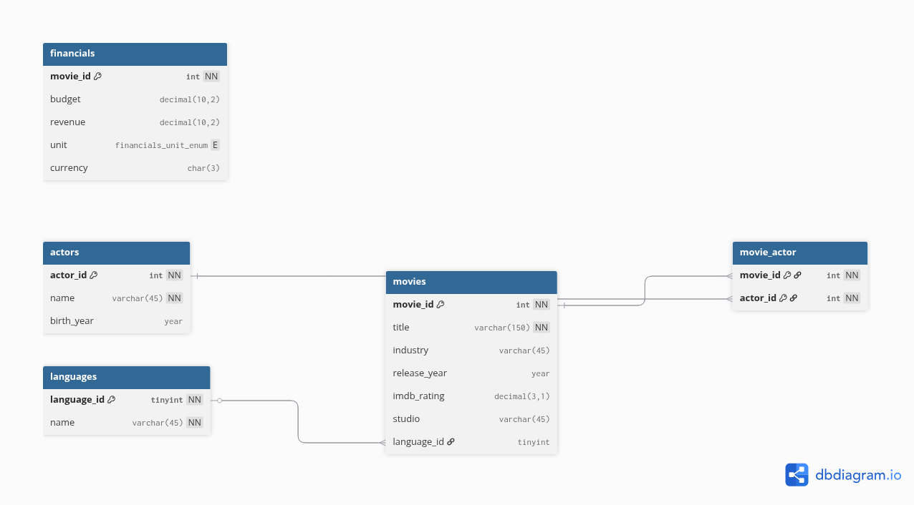

# Database Structure

This project uses a **MySQL** relational database to manage movie data, actors, languages, and financial information.  
It includes one enumeration type for financial units, and several tables capturing movie details, actor participation, and financial metrics.

---

## Overview

| Table Name | Description | Primary Key | Rows (Approx.) |
|-------------|--------------|--------------|----------------|
| `actors` | Stores actor details | `actor_id` | — |
| `movies` | Stores movie information | `movie_id` | — |
| `languages` | Stores languages associated with movies | `language_id` | — |
| `financials` | Stores budget and revenue information for movies | `movie_id` | — |
| `movie_actor` | Many-to-many mapping between movies and actors | `(movie_id, actor_id)` | — |

| Enum Name | Description |
|------------|--------------|
| `financials_unit_enum` | Defines units of financial values (e.g., Units, Thousands, Millions, Billions) |

---

## Schema Details

### `actors`
Stores actor information.

| Column | Type | Description |
|---------|------|-------------|
| `actor_id` | INT (PK, AUTO_INCREMENT, NOT NULL) | Unique identifier for each actor |
| `name` | VARCHAR(45) (NOT NULL) | Actor’s name |
| `birth_year` | YEAR | Year of birth |

---

### `movies`
Stores movie details.

| Column | Type | Description |
|---------|------|-------------|
| `movie_id` | INT (PK, AUTO_INCREMENT, NOT NULL) | Unique movie identifier |
| `title` | VARCHAR(150) (NOT NULL) | Movie title |
| `industry` | VARCHAR(45) | Film industry (e.g., Hollywood, Bollywood) |
| `release_year` | YEAR | Year the movie was released |
| `imdb_rating` | DECIMAL(3,1) | IMDb rating (0.0 – 10.0) |
| `studio` | VARCHAR(45) | Producing studio |
| `language_id` | TINYINT | Foreign key referencing `languages.language_id` |

---

### `languages`
Stores supported languages.

| Column | Type | Description |
|---------|------|-------------|
| `language_id` | TINYINT (PK, AUTO_INCREMENT, NOT NULL) | Unique identifier for language |
| `name` | VARCHAR(45) (UNIQUE, NOT NULL) | Language name |

---

### `financials`
Stores financial information related to movies.

| Column | Type | Description |
|---------|------|-------------|
| `movie_id` | INT (PK, NOT NULL) | Foreign key referencing `movies.movie_id` |
| `budget` | DECIMAL(10,2) | Movie budget |
| `revenue` | DECIMAL(10,2) | Movie revenue |
| `unit` | ENUM(`Units`, `Thousands`, `Millions`, `Billions`) | Units of financial amounts |
| `currency` | CHAR(3) | Currency code (e.g., USD, INR) |

---

### `movie_actor`
Mapping table for the **many-to-many relationship** between movies and actors.

| Column | Type | Description |
|---------|------|-------------|
| `movie_id` | INT (NOT NULL) | Foreign key referencing `movies.movie_id` |
| `actor_id` | INT (NOT NULL) | Foreign key referencing `actors.actor_id` |
| Primary Key | `(movie_id, actor_id)` | Composite primary key ensuring uniqueness |

---

## Relationships

- **movies → languages**: Many-to-one (`movies.language_id` → `languages.language_id`)  
- **movie_actor → movies**: Many-to-one (`movie_actor.movie_id` → `movies.movie_id`)  
- **movie_actor → actors**: Many-to-one (`movie_actor.actor_id` → `actors.actor_id`)  

**Relationship Rules:**  
- `UPDATE CASCADE`, `DELETE RESTRICT` for foreign keys in `movie_actor` and `movies`.

---

## Enumerations

### `financials_unit_enum`
Defines allowed units for budget and revenue fields.

| Value | Description |
|-------|-------------|
| `Units` | Amounts expressed as units (1) |
| `Thousands` | Amounts expressed in thousands |
| `Millions` | Amounts expressed in millions |
| `Billions` | Amounts expressed in billions |

---

## Diagram

> Diagram generated using [dbdiagram.io](https://dbdiagram.io)

---

## Notes

- All foreign key constraints enforce referential integrity.  
- `movie_actor` is a **junction table** implementing many-to-many relationships between movies and actors.  
- `financials.unit` is an ENUM type ensuring consistent representation of large financial figures; specifies the scale of budget and revenue values (Units, Thousands, Millions, or Billions).  
- This schema is suitable for movie analytics, actor-filmography tracking, and financial reporting.

---
